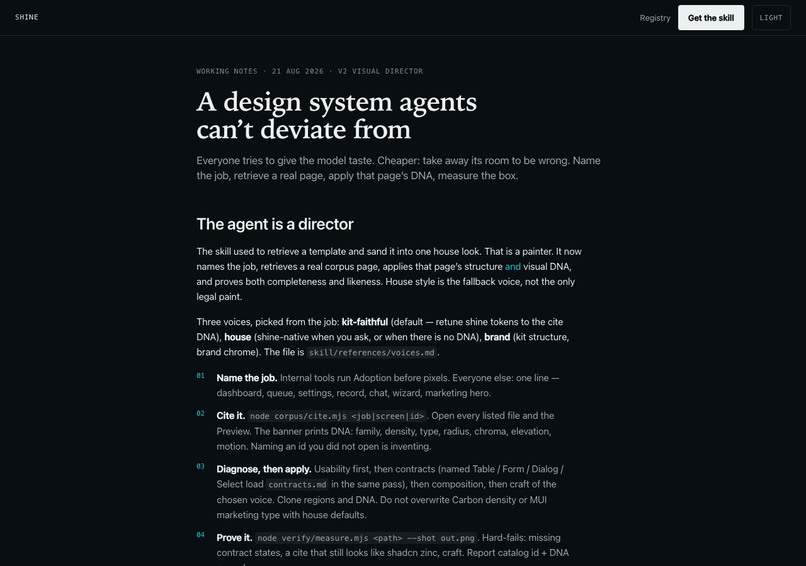
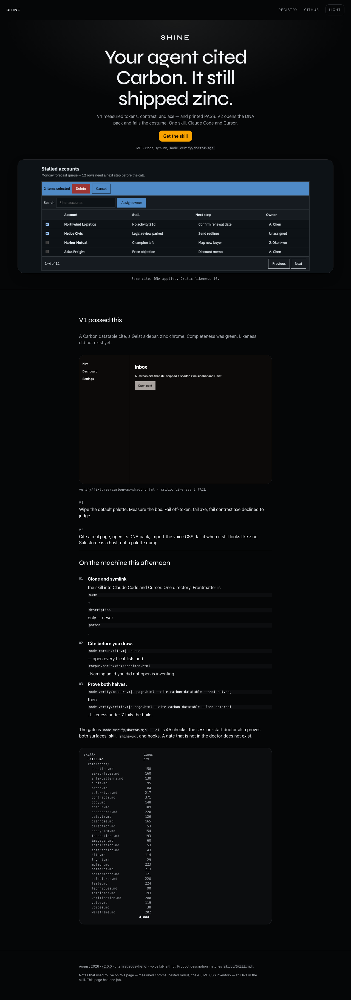

# Shine 2.0 — I built a compliance officer and called it a designer

Paste-ready LinkedIn article. Fold shots of [shine-blond.vercel.app](https://shine-blond.vercel.app) before and after a V2 pass on the same page. Frozen V1 HTML: `docs/linkedin-v2/pre.html`.

---

## LinkedIn post (short)

I shipped Shine 1.0 as “a design system agents can’t deviate from.”

What I actually shipped was a **compliance officer**. Tokens, contrast, axe, composition. It would retrieve a Carbon datatable, paint Geist zinc on it, and print PASS.

V2 is the missing half: **likeness**.

The agent has to open a visual DNA pack (not just name a catalog id), import voice CSS that actually changes `--shine-*`, and fail a critic when the cite still looks like shadcn. Salesforce is a host (record / console / LWR / email / mobile), not a palette dump.

I ran V2 against Shine’s own public page. The notes essay is gone. First viewport is kit-faithful Magic UI: Syne display, gold primary, one Carbon queue. The costume V1 passed sits in the proof band.

Before / after:

Repo: https://github.com/justinfowler925/shine/releases/tag/v2.0.0

---

## Article

I spent a month teaching an agent not to invent hex values.

That was the right first problem. Generated UI is ugly for a boring reason: every project on earth is shipping the same default tokens. Wipe the palette, own the type scale, measure the rendered box. Shine 1.0 did that. The doctor proved the hooks bit. Contrast that axe declined to judge, we sampled per-pixel.

Then I watched it cite IBM Carbon and emit a zinc sidebar.

Nothing in V1 could see that. `cite.mjs` printed seven string labels (`family=carbon`, `radius=none`). There was no remap. Measure wrote a PNG and never looked at it — while the public page claimed “screenshot critique, three passes.” Completeness passed. Likeness was a slogan.

That is what I got wrong.

**V1 answered “is this on-token?”** It did not answer “does this look like the page you claimed to clone?” A catalog of 132 rows, 102 of them the same shadcn-zinc DNA object, will retrieve *something* and still paint the same dashboard. Naming `carbon-datatable` without opening the specimen is inventing. I had made inventing look like a cite.

**V2 is the director loop I had written in prose and not built.**

1. **DNA packs.** `corpus/packs/<id>/` — specimen HTML, expanded DNA, region occupancy. The agent has to `Read` the specimen. Reporting `images_read` is part of the job.
2. **Executable voices.** `tokens/voices/carbon.css` remaps radius to 0 and sans to IBM Plex. “Retune the tokens” is no longer a sentence with no file behind it.
3. **A critic.** `verify/critic.mjs` scores likeness to the pack and names a slop class. The fixture that is a Carbon cite in Geist chrome **fails** (likeness 2). The kit-faithful queue **passes** (10). Doctor watches both.
4. **Lanes.** Internal / SaaS / Lightning / marketing are different quality bars. Glow is legal on a Magic UI hero and a fail on a record page.
5. **Salesforce as a host.** Record home at ~494px inside a 1280 window. `@container` on the component, not `@media` on the window. Name the host or fail.
6. **Slop that cannot be pragma-exempted.** Cream `#F4F1EA`, indigo-default, purple glow. A `shine-lint: off` that also excuses those is how they ship.

I did not scrape Dribbble. I did not add a 10,000-word taste essay. The index is still a router. The new work is **vision in the loop** and a gate that can fail a costume.

### Same page, V1 vs V2

Shine’s public page was the tell. It carried `data-cite="mui-blog"` and looked like a house essay: sticky bar, 42px serif, 44rem column, the primary sitting in the nav. That is a working notes layout wearing a Material blog sticker.

**Lane:** marketing. **Cite:** `magicui-hero`. **Voice:** kit-faithful (Syne display, inverted near-black, gold filled primary). One media region. The memoir is cut.

**Before** (V1 fold, dark, 1280×900):

**After** (V2 fold):

### What I am not claiming

Completeness still beats a Behance poster. Internal queues should look like Carbon, not like this hero. Lightning record pages should belong in Cosmos. The Awwwards-shaped bar is for marketing and LWR only.

V2 is MIT, same install: clone, symlink the skill, wire the hooks, `node verify/doctor.mjs`.

[github.com/justinfowler925/shine](https://github.com/justinfowler925/shine) · [Release v2.0.0](https://github.com/justinfowler925/shine/releases/tag/v2.0.0)

---

## Numbers for the post (do not round)

| | V1 page | V2 page |
|---|---|---|
| Catalog id | `mui-blog` (wrong job) | `magicui-hero` |
| `data-dna-family` | absent | `magicui` |
| Critic likeness | 7 | 10 |
| Display size | 42px | 72px |
| Primary | nav button | hero `data-primary` |
| Measure | PASS | PASS |
| Axe | 0 | 0 |
| Contrast worst | 5.69:1 (`--dark`) | 5.56:1 |

Carbon costume fixture (unchanged, the V2 gate): likeness **2**, FAIL. Kit-faithful queue: likeness **10**, PASS.
